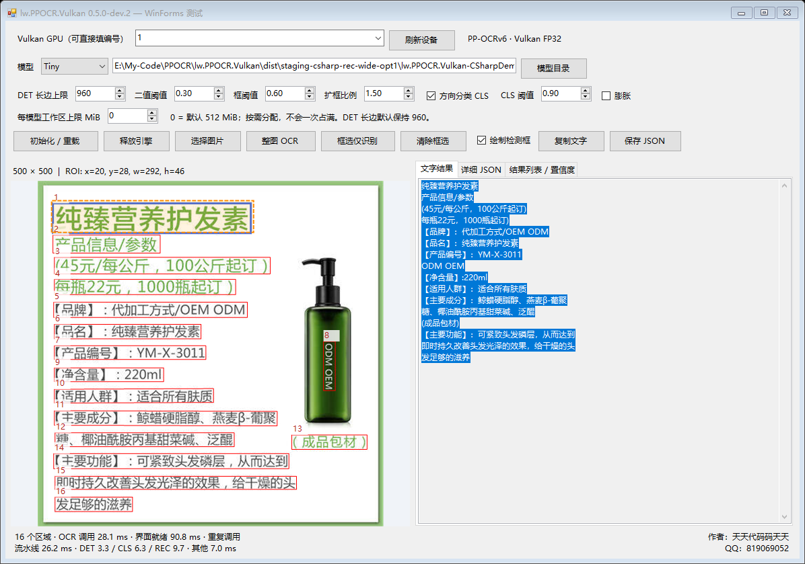

# lw.PPOCR.Vulkan

Latest: [Medium REC wide-tile optimization](docs/REC-WIDE-OPTIMIZATION.md) reuses an input tile across twice as many FP32 pointwise output channels. Against det-vector-opt1, paired RTX 4060 Medium 100-image full-call means improve **3.6%**, and sample REC stage medians improve about **6.8%**, with exact prediction equality. Automatic selection is restricted to eligible NVIDIA REC shapes; Tiny/Small have no acceleration claim. Small first-pass and AMD end-to-end regressions are disclosed in the report. FP32, DET960, budgets and ABI stay unchanged; no new flag. GPU perspective cropping and DB remain unimplemented.

Latest: [DET FP32 vector memory optimization](docs/DET-VECTOR-OPTIMIZATION.md) shares spatial address arithmetic and NHWC loads/stores across four channels. Against rec-batch-opt1, paired RTX 4060 Medium 100-image full-call means improve **4.8%**, with **3.9%/4.2%** gains on a changing stream and exact prediction equality. Tiny/Small remain essentially unchanged. Enable automatically for eligible DET shapes only: an experimental REC dispatch regressed changing-width streams and was not retained. FP32, DET960, resource limits and the public ABI stay unchanged; no new flag is required. The report maps the GPU preprocessing/postprocessing article's lessons to implemented features and retained CPU work.

[中文](README.md)

A C++17 PP-OCR Vulkan GPU inference project with a native C ABI, HTTP/Web service and C# WinForms examples.
No OpenCV DNN, ONNX Runtime or CUDA **runtime** dependency.
Author: 天天代码码天天; QQ: 819069052.
QQ group name: 天天代码码天天
QQ group number: 264292622

## Status: 0.5.0-dev.2 / Tiny, Small and Medium full OCR preview

Implemented: Vulkan device enumeration, experimental length-aware C ABI,
the entire 242-node PP-OCRv6 Tiny DET graph on Vulkan, portable FP32 shaders
derived from pinned upstream kernels, lifetime-reused NHWC workspace,
resident device-local weights and at most 32 LRU shape plans sharing one budget-bounded arena/IO workspace.
Native C++ ONNX protobuf parsing loads official Tiny/Small/Medium files directly;
no customer-side Python, Protobuf or ONNX Runtime is needed. FP32 tiled GEMM,
register-tiled pointwise convolution, fused LayerNorm/attention and GPU greedy CTC
are implemented. See [model sources and loader boundaries](docs/ONNX-MODELS.md).
See the [0.5 local performance and validation report](docs/LOCAL-PERFORMANCE-050.md)
for measured improvements and the limits of the CPU comparison.
See the [100-image, three-project benchmark](docs/THREE-PROJECT-100.md)
for Tiny/Small/Medium speed, process RAM, WDDM GPU memory and ground-truth accuracy.
It calls the actual C and legacy DML project DLLs, not the unified DML reference helper.
Batching and REC width policies differ, so it measures deployed pipelines rather than identical operators.
The latest [host-pipeline optimization report](docs/PIPELINE-OPTIMIZATION.md)
records mean Tiny/Small/Medium latency of 41.04/50.53/98.98 ms on the same 100-image corpus,
with identical prediction objects. Results apply to the measured local conditions, not every GPU/image.
The earlier [host/readback report](docs/HOST-TRANSFER-OPTIMIZATION.md) remains a historical comparison.

The new [GPU DET preprocessing experiment](docs/GPU-DET-PREPROCESS-EXPERIMENT.md) fuses resize, normalization and input packing directly into the DET arena. It is **off by default**, requires `shaderFloat64`, and keeps FP32 networks/DET cap 960. Enable `LWVK_GPU_DET_PREPROCESS=1` before launching a new process, or use the separate experimental Demo launcher. On RTX 4060, paired 100-image mean latency fell by 18.0%/12.1%/5.9% for Tiny/Small/Medium with every prediction field unchanged; this is not a universal speed or DML-superiority claim.

The follow-up [GPU CLS/REC preprocessing and upload experiment](docs/GPU-TEXT-PREPROCESS-EXPERIMENT.md) reduces mean latency by another **14.6%/10.3%/4.8%** for Tiny/Small/Medium against that DET-only baseline on the same 100 images, with exact prediction-field equality. `LWVK_GPU_TEXT_PREPROCESS=1` fuses text-line resize, gray padding, normalization and REC 180-degree sampling, while segmented uploads eliminate a full-source temporary copy. Both experiments remain off by default and require `shaderFloat64`; networks stay FP32. The complete C# package includes `Start-CSharp-Demo-GPU-Preprocess-Experiment.bat` to enable both. The normal launcher retains CPU preprocessing.

The latest [FP32 pointwise optimization](docs/POINTWISE-OPTIMIZATION.md) uses contiguous vector stores, a small-spatial kernel and guarded Conv→SiLU epilogues, selected automatically without a new flag. Against the previous GPU-preprocessing build, paired 100-image means improve by another **2.1%/3.0%/3.3%** for Tiny/Small/Medium. Both sides enable GPU preprocessing for that comparison. RTX/AMD tests retain exact FP32 output bits across 27 shapes per device; the default CPU-preprocessing path also passes. FP32 networks and DET960 remain unchanged.

The follow-up [bounded CLS submission batching](docs/CLS-BATCH-OPTIMIZATION.md) groups at most eight independent text-line commands into one submission/fence when GPU text preprocessing is enabled; REC remains sequential. Cropped staging and combined workspace stay bounded, with sequential fallback under tight budgets. Against network-opt1, paired RTX 4060 100-image means improve another **6.0%/6.3%/2.4%** for Tiny/Small/Medium, with exact item equality. Use the existing GPU-preprocessing experimental launcher; no new flag is required. The normal CPU-preprocessing path has no claimed equivalent speedup.

The latest [REC shared-arena submission optimization](docs/REC-BATCH-OPTIMIZATION.md) groups up to eight serial line commands with independent raw input/compact CTC IO and one shared tensor arena. It avoids unused full-logit readback and retains the workspace cap. Against cls-batch-opt1, warmed 100-image means improve **3.3%/2.6%/1.2%** for Tiny/Small/Medium; a changing stream without per-image warmup improves **6.2%/4.1%/1.9%** on its first pass, with exact prediction equality. Use the existing GPU-preprocessing experimental launcher. It is not batch-N or guaranteed parallel inference; the normal launcher has no equivalent speedup claim.

Also implemented: Tiny CLS/REC GPU graphs, native greedy CTC decoding,
length/stride-checked BGR recognition-only, adaptive width and C#/Python image examples.
Full OCR now composes DB boxes, reading order, perspective crops, tall-region rotation,
optional CLS/180-degree correction and REC. Independent result handles return JSON
with coordinates, text, confidence and stage timing. Crop memory/work is bounded.
The single-engine HTTP/Web service supports binary/Base64, full/REC-only/batch,
API Key, bounded queues/decoding, split rotating logs and service scripts.
The C# WinForms tester supports editable GPU selection, full OCR, mouse-selected
recognition-only, box overlays, text/JSON/confidence and timing.

Not available as a release mode: automatic CPU fallback or FP16 performance mode.
A separately gated cooperative-matrix experiment exists, but fails the current real-model accuracy gate and remains off by default.
This is not a production OCR release. The ABI and internal model format are not frozen.

## How it works

The C++ runtime loads supported ONNX graphs and implements their operations with
Vulkan Compute; it does not forward OCR to another inference framework. Vulkan is
a GPU API, not an OCR model or an automatic ONNX executor. Models determine recognition
capability; this project supplies graph execution, image processing and integration APIs.

```text
Image / camera BGR pixels
  → CPU: DET resize and normalization
  → GPU: DET network and text probability map
  → CPU: DB postprocessing, reading order and perspective crops
  → GPU: optional CLS; CPU rotates the line if needed
  → CPU: REC preprocessing → GPU: REC network and greedy label selection
  → CPU: CTC repeat/blank removal, dictionary mapping and result assembly
  → C ABI → C# WinForms / Python / HTTP and Web
```

This diagram describes the normal CPU-preprocessing launcher. The GPU-preprocessing experimental launcher moves DET/CLS/REC resize, normalization, packing and REC 180-degree sampling to the GPU. DB, sorting, perspective cropping, orientation decisions and dictionary mapping remain on the CPU. Bounded CLS/REC command grouping is not parallel batch-N inference, and the three networks do not yet share one uploaded original-image buffer.

- **Loading:** a bounded native ONNX protobuf reader normalizes/lowers supported operations and applies validated fusions. It supports the pinned PP-OCRv6 Tiny/Small/Medium assets, not arbitrary ONNX models.
- **Execution:** compute shaders are compiled to SPIR-V and embedded at build time. Runtime pipelines execute convolution, matrix and attention operations in default FP32, with command submission and fence synchronization. No CUDA runtime is required.
- **CPU/GPU split:** neural networks execute on the GPU; geometry and part of decoding remain on the CPU. GPU OCR is not an entirely GPU-resident pipeline.
- **Reuse:** weights remain GPU-resident after initialization. Tensor lifetimes share workspace, and up to 32 shape plans share arena/IO buffers. Workspace limits do not cap total process/VRAM usage; weights, driver and CPU buffers are additional.
- **Recognition-only:** pre-cropped lines and Demo selections run REC/CTC without DET or CLS. The caller handles orientation correction when needed.
- **Devices:** selection is explicit and calls on one handle are serialized. Availability depends on capabilities and tested drivers, not a promise for every GPU. Missing devices/GPU failures are reported without silent CPU fallback. Deployment needs a matching Vulkan loader/vendor driver, but not Python or the Vulkan SDK.

## Build

Windows: Visual Studio 2022 C++, CMake >=3.20, Python >=3.9, Vulkan SDK with
`glslc` (local development SDK: 1.4.350.0).

```powershell
cmake -S . -B build/local -G "Visual Studio 17 2022" -A x64
cmake --build build/local --config Release --parallel 4
ctest --test-dir build/local -C Release --output-on-failure
.\build\local\Release\lw-ppocr-vulkan-probe.exe
```

Linux build prerequisites: CMake, Ninja, C++17 compiler, Python/numpy,
`libvulkan-dev`, `glslc` and optionally `spirv-tools`.
Configure with `-G Ninja -DCMAKE_BUILD_TYPE=Release`, then build and run CTest.
On Ubuntu, install `libvulkan-dev`, not just the runtime package `libvulkan1`.
SDK headers and `glslc` alone do not satisfy the loader link-library requirement;
otherwise CMake can report `missing: Vulkan_LIBRARY`. Compiled-package users do not need this development package.
Linux, ARM64/domestic distributions and macOS require separate validation;
a Windows test does not establish their compatibility.

The checked-in CI definitions build/package Windows x64 and Linux x64.
Windows checks host ABI only when hardware is unavailable (explicit SKIP).
Linux runs an independent DET reference test using software Vulkan/lavapipe,
not a hardware acceleration benchmark. SDK downloads are pinned and SHA-256
verified. Workflows have not been run remotely for this new project yet.

Compiled packages do not need Python or the Vulkan SDK. They need a matching
Vulkan >=1.1 driver/loader. Device IDs follow Vulkan enumeration order; no
implicit discrete-first remapping. Device type 4 means software Vulkan, not hardware GPU.

## WinForms quick start

Extract the Windows package and run `lw.PPOCR.Vulkan.WinFormsDemo.exe`.
Requires x64 Windows, .NET Framework 4.0+ and a Vulkan >=1.1 driver/loader;
no Python, Vulkan SDK or NuGet dependencies are needed to run it.
Tested locally on Windows 10. The .NET target does **not** establish Win7 native compatibility.

1. Select a GPU from the editable dropdown, or type its numeric ID (`0`, `1`, etc.).
   IDs follow actual Vulkan enumeration; invalid IDs are rejected, never silently remapped.
2. Initialize/reload the engine. Model/sample paths are resolved against the executable directory.
3. Run full OCR to see boxes, text, JSON, confidence and wall/GPU-stage timings.
4. Drag a text region in either direction and run recognition-only: REC + CTC, no DET/CLS.
   Zoomed coordinates are mapped back to source pixels; overlays never modify inference pixels.
5. Reinitialize after changing the GPU/model/thresholds. Load your own image, copy text or save JSON.

Select bundled PP-OCRv6 Tiny/Small/Medium ONNX models; the old Tiny converted format remains supported, not arbitrary ONNX. First-run plan creation
is included in wall time; it is not a steady-state benchmark.
See [usage and validation](docs/WINFORMS-DEMO.md) and
[Visual Studio solution](examples/winforms/lw.PPOCR.Vulkan.WinFormsDemo.sln).
Windows CI performs application-owned layout/ROI smoke tests, not GPU inference.

<a href="docs/assets/winforms-demo.png"></a>

Actual `rec-wide-opt1` sharing bundle on RTX 4060 Laptop GPU with the Tiny model and experimental GPU DET/CLS/REC preprocessing enabled, showing full-image detection and mouse-selected recognition. Timings illustrate this repeated invocation only, not all devices/images or the Medium benchmark. Click to view the full-size screenshot.

### Understanding Demo timings

| Display | Measurement boundary |
| --- | --- |
| OCR call | C# Bitmap-to-BGR conversion, native OCR, JSON copy, UTF-8 decoding and C# JSON parsing; excludes model initialization and prior image-file loading |
| UI ready | Image cloning, background scheduling, OCR call and UI result-data updates from the run handler; not completion of actual screen painting |
| Pipeline | Native OCR from handle-lock waiting through preprocessing, inference, postprocessing and result-object assembly; excludes final JSON serialization and ABI result copying |
| DET / CLS / REC | Accumulated network execution durations including upload, submission, GPU waiting and readback; not pure GPU shader time, and excluding execution-plan preparation |
| Other | `max(0, pipeline − DET − CLS − REC)`: a residual, not an independently timed operation |

Other includes CPU resizing/normalization/layout conversion, DB contours/box expansion/reading
order, perspective crops and rotation, CLS/REC preprocessing, CPU CTC repeat/blank removal,
dictionary mapping and result assembly, plus plan preparation, workspace allocation and lock waiting.
Pipeline time therefore need not equal DET + CLS + REC. Upload/wait/readback are already counted
in network timings, not counted again in Other. C# pixel conversion, JSON copying/parsing and
UI updates are outside Other.

First calls/new shapes may prepare plans or grow workspace; do not treat them as warmed-up
performance. One-decimal displays can introduce rounding differences. Compare the same image,
model, device, parameters and timing boundaries; report initialization, first and repeated calls separately.

## HTTP / Web quick start

Run the probe, set `device_index` in `http-service.json`, then launch
`run-http-service.bat` (Windows) or `./run-http-service.sh` (Linux).
Open `http://127.0.0.1:8787/`, load the sample or your image and run OCR.
The page draws canonical boxes and shows text/JSON plus wall and GPU-stage timings.
Recognition-only expects an already-cropped text line, with no DET/CLS.

POST `/api/ocr` or `/api/recognize` accepts JPEG/PNG/BMP binary bodies
(`application/octet-stream`) or JSON `{"image_base64":"..."}`.
REC-only also accepts `{"images_base64":["...","..."]}`, processed sequentially.
Nonempty `api_key` requires the `X-API-Key` header; the web page sends that header
without URL/local-storage persistence. `LWVK_API_KEY` overrides config (empty disables).
Keys, image bodies and OCR text are not logged. Default binding is localhost;
use authentication, firewall and HTTPS reverse proxy before external deployment.

One engine serializes decode/inference; workers and transport queue are bounded.
Queue overflow returns best-effort 429 (an unparsed transport rejection has no request ID).
Waiting for the engine times out with 503; it does not cancel GPU work.
Runtime GPU faults poison the engine, requiring a restart rather than silent fallback.
Decoder allocations and single/batch pixel budgets limit image memory.
`logging_enabled` and `access_log_enabled` control rotating runtime/JSONL access logs.
Windows SCM and Linux systemd install/start/stop/restart/uninstall scripts are bundled;
target-machine service-account/GPU access still needs separate verification.

See [HTTP service details](docs/HTTP-SERVICE.md) and [local HTTP test report](docs/LOCAL-HTTP-REPORT.md).

## Independent GPU correctness test

```powershell
python -m pip install -r requirements-dev.txt
python tests/test_det_reference.py --library build/local/Release/lw.PPOCR.Vulkan.dll --device 0 --iterations 100 --report build/reports/device0.json
```

Tests use identical FP32 inputs for CPU/GPU, multiple image sizes, probability-map
error and threshold-map IoU, invalid inputs/recovery and repeated shape changes.
ONNX Runtime is an optional test dependency, not a native runtime dependency.
RSS observations alone do not prove leak freedom. GPU validation layers,
host sanitizers and extended physical-device tests remain required.

Input: normalized FP32 NCHW `[1,3,H,W]`, H/W multiples of 32 in 32..960.
Output: FP32 `[H,W]` probability map, not text or boxes.
Generic graph API additionally supports CLS `[1,3,80,160]` -> `[1,2]` and REC
`[1,3,48,W]` -> `[T,C]`, C=6906 for Tiny or 18710 for Small/Medium; W=32..960 and a multiple of 8. CLS/REC use BGR [-1,1].
`lwvk_recognize_tensor` returns native UTF-8 text and mean emitted-label confidence.
Text buffer sizes include the trailing NUL; insufficient capacity returns 5 without truncation.
See `include/lw_ppocr_vulkan.h` and `examples/python/lwvk.py`.
Calls on the same handle are serialized; never destroy a handle during an active call.
Default graph workspace limit: 512 MiB for the shared arena and IO buffers, excluding weights and driver allocations.
This is an on-demand ceiling, not an upfront reservation. WinForms exposes a per-graph MiB limit (0=default).
DET keeps its default longest-side limit of 960; reducing image size is not a performance improvement claim.
See [workspace fixes, DML baseline and remaining optimization](docs/WORKSPACE-PERFORMANCE.md).
See [operator profiling and the second FP32 optimization round](docs/GPU-PROFILING.md): diagnostics default off; large-image DML gaps remain.
The [third FP32 round](docs/GELU-FUSION.md) adds guarded GELU fusion and matched full-OCR measurements. Medium large-image latency improved, but it still trails DML; DET-960 and accuracy gates remain unchanged.
These are historical baselines. The [fourth FP32 round](docs/HOST-TRANSFER-OPTIMIZATION.md)
improves cached readback, persistent mappings and CPU preprocessing; it passes six
matched-host DML comparisons, but does not establish superiority on every input/device.
See the [opt-in cooperative-matrix experiment](docs/COOPERATIVE-MATRIX-EXPERIMENT.md); it does not replace the tested FP32 deployment package.
Explicit Vulkan failures do not silently fall back. The 30-second fence timeout
is not cancellation; a failed plan cannot be reused.

The default models are now direct ONNX under `models/onnx/ppocrv6-tiny`, with matching dictionaries. Legacy Tiny internal v0 assets remain compatible:
`models/ppocrv6-tiny/det.json` + `weights.bin`. The exporter checks the exact model SHA-256.

## Attribution

Apache-2.0; see `LICENSE` and [NOTICE](NOTICE) for third-party sources, pinned revisions and modifications. Complete dependency licenses are retained in `licenses`.
nlohmann/json is MIT. Model assets retain upstream attribution and licensing.
Port correctness and performance must be measured independently.

See [compatibility evidence](docs/COMPATIBILITY.md), [DET report](docs/LOCAL-DET-REPORT.md),
[CLS/REC report](docs/LOCAL-TEXT-REPORT.md)
and [full OCR report](docs/LOCAL-OCR-REPORT.md), plus [roadmap](docs/ROADMAP.md).
Full OCR tests use independent ORT graphs/NumPy preprocessing/CTC but share C geometry;
they are NOT independent DB algorithm comparisons. Python tests use Python >=3.10 (CI: 3.12).

To create a technical-preview package after testing:

```powershell
cmake --install build/local --config Release --prefix dist/staging
python tests/test_api.py --library dist/staging/lw.PPOCR.Vulkan.dll
python scripts/package.py --staging dist/staging --output dist --platform windows-x64
```

The package contains the library, probe, DET/CLS/REC assets, dictionary, examples, sample image and
documentation, HTTP/Web, service scripts and a SHA-256 sidecar.
Windows uses the static MSVC runtime; inspected direct DLL dependencies are
`vulkan-1.dll` and `KERNEL32.dll`. Install the GPU vendor's Vulkan driver/loader;
do not copy development-machine driver files as a deployment substitute.
If the build machine has the .NET Framework C# compiler, the package also includes
an x64 console interop demo alongside the WinForms tester:

```powershell
.\lw-ppocr-vulkan-probe.exe
.\lw.PPOCR.Vulkan.CSharpDemo.exe models/ppocrv6-tiny/det.json 1
.\lw.PPOCR.Vulkan.CSharpDemo.exe --recognize models/ppocrv6-tiny/rec/model.json test-images/sample.jpg 1 20 28 292 46
.\lw.PPOCR.Vulkan.CSharpDemo.exe --ocr models/ppocrv6-tiny test-images/sample.jpg 1
```

Replace `1` with the device index printed by the probe.

## Recognition-only from a cropped text region

`lwvk_recognize_bgr` accepts BGR8 pixels with a positive byte stride and explicit
buffer length >= `(height-1)*stride+width*3`. Source images are capped at 40M pixels.
It performs bilinear resize, aspect-preserving right padding (normalized byte 128),
GPU REC/greedy CTC and CPU character assembly. It does **not** run DET or automatically rotate using CLS.
`rec_width=0` chooses an adaptive multiple of 8 in 32..960; very long lines may be compressed.
Reported GPU time excludes image decoding/preprocessing/CTC.

```powershell
python examples/python/recognize_image.py --library build/local/Release/lw.PPOCR.Vulkan.dll --model models/ppocrv6-tiny/rec/model.json --image test-images/sample.jpg --roi 20 28 292 46 --device 1
```

The ROI here is supplied manually, not automatically detected. Local output:
`纯臻营养护发素`. Omit `--roi` when the customer image is already cropped.
Camera pixel buffers can call the same native API without JPEG/Base64 encoding.
See the [Demo timing and presentation revision](docs/DEMO-TIMING-OPTIMIZATION.md) for UTF-8 fixes, on-demand detail tabs, and separate OCR-call, native-pipeline and UI-ready measurements. Native models and precision remain unchanged.

The latest [host-pipeline optimization](docs/PIPELINE-OPTIMIZATION.md) reduces redundant CLS/REC resize and crop work without changing FP32, models or shaders. Paired RTX 4060 tests improve Tiny by 20–24%, Small by ~16% and Medium by 9–10%; all 100-image predictions remain exactly equal. Other GPUs may not gain equally.

The [complete C# sharing preview](docs/CSHARP-SHARE-PACKAGE.md) bundles three
models, an official x64 Vulkan loader, an optional Runtime installer and C#
source. A compatible installed GPU vendor driver is still required.

See the [development guide](docs/DEVELOPMENT.md) for first-party formatting and ownership/synchronization boundaries.

## Full-image OCR

The optional Python image example needs `python -m pip install numpy pillow`;
the compiled native library/C# console demo does not need Python or the Vulkan SDK.

```powershell
python examples/python/ocr_image.py --library build/local/Release/lw.PPOCR.Vulkan.dll --models models/ppocrv6-tiny --image test-images/sample.jpg --device 1 --draw build/ocr-boxes.png
```

Add `--no-cls` to disable classification. JSON `items` contains `x1/y1` through
`x4/y4` (top-left, top-right, bottom-right, bottom-left) in source coordinates,
`text`, `score`, `det_score`, `cls_label` and `cls_score`, without a duplicate box array.
Disabled CLS returns label -1, score 0. This is line OCR, not PDF/layout/table analysis;
recognition errors remain possible. Graph workspace defaults to 512 MiB PER GRAPH,
including shared staging/IO; up to three graphs plus weights/driver/CPU geometry memory.
Initialize config with `lwvk_ocr_config_default`, then create/run the engine.
The independently owned result survives engine destruction; query/copy JSON does
not rerun inference. Destroy results explicitly. Never destroy engines/results
while another call uses them. See [OCR API contract](docs/OCR-API.md).

## Support the project

If this project helps you, optional donations support open-source maintenance.
Thank you for using the project, reporting issues and contributing!

<a href="www/sponsor.jpg"></a>

[View the full-size QR code](www/sponsor.jpg). The HTTP web page also includes a donation button.
